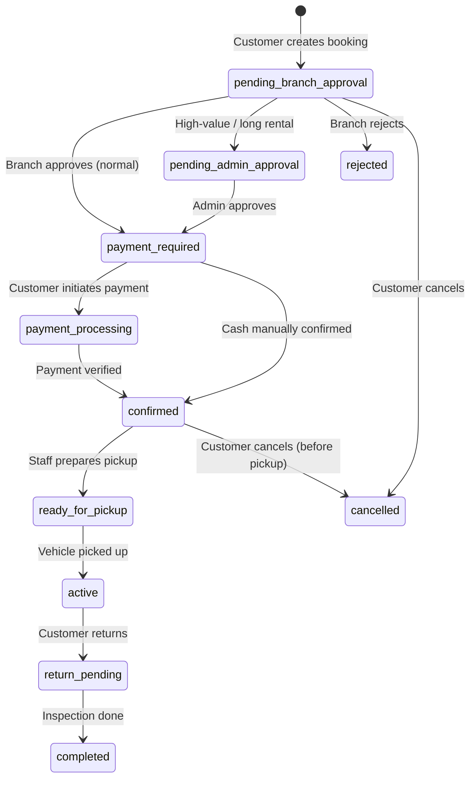
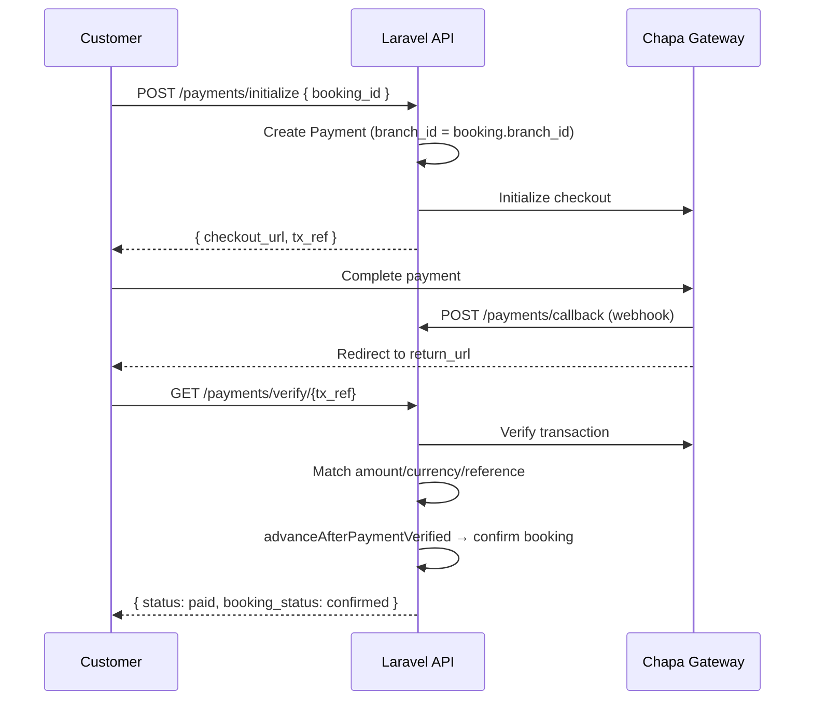
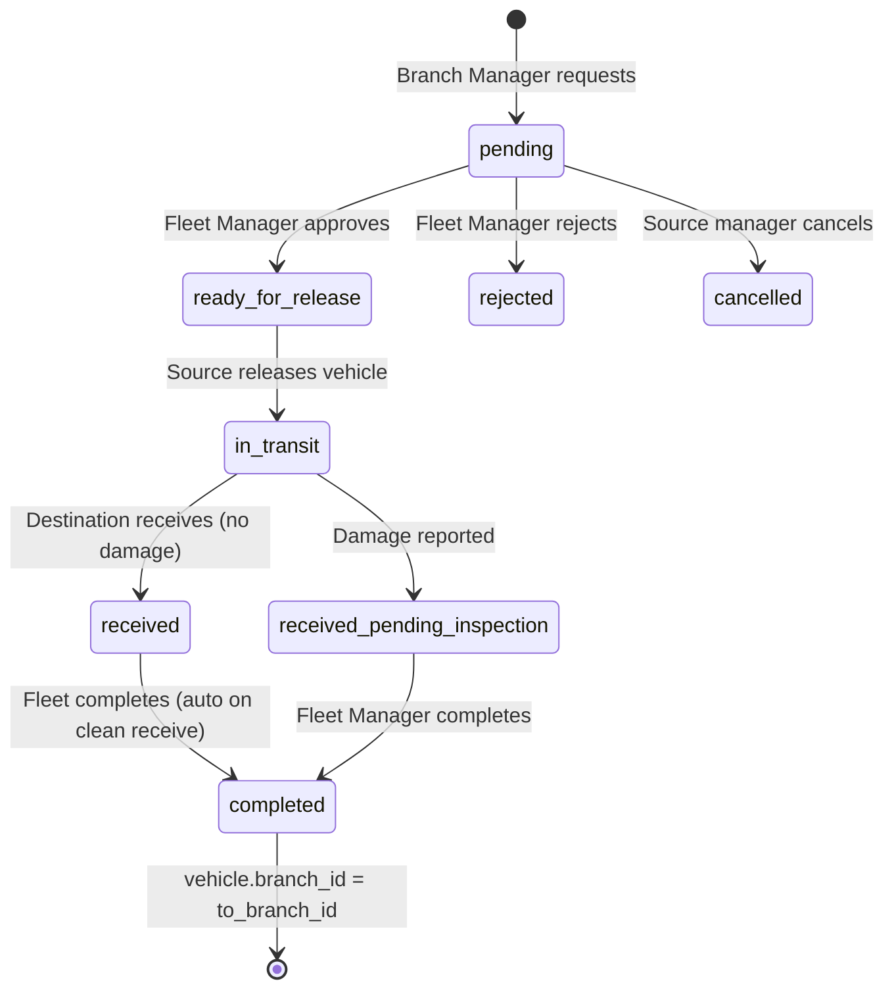
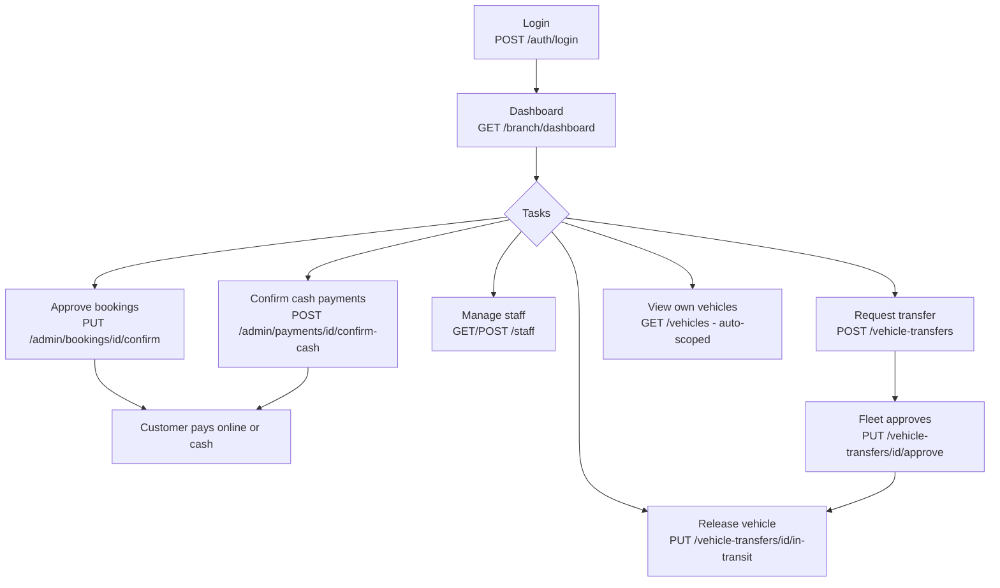

# Apex Rentals — System API Flow Documentation

> **Base URL:** `/api`  
> **Auth:** Laravel Sanctum (`Authorization: Bearer {token}`)  
> **Response envelope:** `{ success, message, data, meta? }`  
> **Last updated:** August 2026 (reflects branch-based access control implementation)

---

## Table of Contents

1. [Architecture Overview](#1-architecture-overview)
2. [Roles & Branch Access Model](#2-roles--branch-access-model)
3. [Authentication API](#3-authentication-api)
4. [Branch API Flow](#4-branch-api-flow)
5. [Vehicle API Flow](#5-vehicle-api-flow)
6. [Booking API Flow](#6-booking-api-flow)
7. [Payment API Flow](#7-payment-api-flow)
8. [Vehicle Transfer API Flow](#8-vehicle-transfer-api-flow)
9. [End-to-End Customer Journey](#9-end-to-end-customer-journey)
10. [Branch Manager Operational Flow](#10-branch-manager-operational-flow)
11. [Status Reference Tables](#11-status-reference-tables)
12. [Security Rules (Backend Enforced)](#12-security-rules-backend-enforced)
13. [Frontend Portal → API Mapping](#13-frontend-portal--api-mapping)

---

## 1. Architecture Overview

```
┌─────────────────────────────────────────────────────────────────┐
│                        React Frontend                            │
│  / (customer)  /admin  /branch  /fleet  /staff                  │
└────────────────────────────┬────────────────────────────────────┘
                             │ HTTPS + Bearer Token
┌────────────────────────────▼────────────────────────────────────┐
│                     Laravel API (/api)                           │
│  ┌─────────────┐  ┌──────────────┐  ┌─────────────────────────┐ │
│  │ auth:sanctum│  │ role:...     │  │ optional.auth (vehicles)│ │
│  └─────────────┘  └──────────────┘  └─────────────────────────┘ │
│  ┌─────────────────────────────────────────────────────────────┐ │
│  │ Controllers → Policies (Gate) → Services → Models           │ │
│  │ BranchScopeService enforces branch isolation                │ │
│  └─────────────────────────────────────────────────────────────┘ │
└────────────────────────────┬────────────────────────────────────┘
                             │
┌────────────────────────────▼────────────────────────────────────┐
│  PostgreSQL — branch_id denormalized on bookings, payments,     │
│  reviews, maintenance, transfers (from_branch_id / to_branch_id) │
└─────────────────────────────────────────────────────────────────┘
```

### Key services

| Service | Responsibility |
|---------|----------------|
| `BranchService` | Resolve branch for dashboard, stats, customers |
| `BranchScopeService` | Central branch filter / IDOR protection |
| `BookingService` | Create/cancel bookings, price calculation |
| `BookingWorkflowService` | State machine: approve → pay → pickup → return |
| `PaymentService` | Chapa init/verify, cash confirm, refunds |
| `VehicleTransferService` | Full transfer lifecycle |

---

## 2. Roles & Branch Access Model

| Role | Code | Branch scope | Company-wide |
|------|------|--------------|--------------|
| Super Admin | `super_admin` | All branches | Yes |
| Main Admin | `admin` | All branches | Yes |
| Fleet Manager | `fleet_manager` | Fleet ops across all branches | Fleet only |
| Branch Manager | `branch_manager` | **Own `branch_id` only** | No |
| Staff | `staff` | **Own `branch_id` only** | No |
| Customer | `customer` | Public cross-branch search | N/A |

### Branch isolation rule

```
branch_id for authorization = auth()->user()->branch_id
NEVER trust request.body.branch_id or ?branch_id= for branch managers/staff
```

**Exceptions:**
- Customers may search vehicles across active branches
- Branch managers may call `GET /branches/transfer-destinations` (minimal branch list only)
- Admin / Fleet Manager bypass branch filters

---

## 3. Authentication API

| Method | Endpoint | Auth | Description |
|--------|----------|------|-------------|
| POST | `/auth/register` | None | Register customer |
| POST | `/auth/login` | None | Returns Sanctum token |
| POST | `/auth/logout` | Sanctum | Revoke token |
| GET | `/auth/me` | Sanctum | Current user + branch |
| PUT | `/auth/profile` | Sanctum | Update profile |

### Login response (simplified)

```json
{
  "success": true,
  "data": {
    "user": {
      "id": 5,
      "name": "CMC Manager",
      "email": "cmc@apexrentals.com",
      "role": "branch_manager",
      "branch_id": 2,
      "branch": { "id": 2, "name": "CMC Branch", "code": "CMC" }
    },
    "token": "1|abc..."
  }
}
```

---

## 4. Branch API Flow

### 4.1 Public branch discovery (Customer)

```
Customer → GET /branches
         → GET /branches/{id}
         → GET /branches/{id}/reviews
```

| Method | Endpoint | Auth | Roles | Notes |
|--------|----------|------|-------|-------|
| GET | `/branches` | None | Public | Active branches only (non-admin) |
| GET | `/branches/{branch}` | None | Public | Branch details |
| GET | `/branches/{branch}/reviews` | None | Public | Public reviews |

**Query params (list):** `?status=active`

### 4.2 Transfer destination selector (Internal)

```
Branch Manager → GET /branches/transfer-destinations
               → Returns active branches EXCEPT own branch
               → Only: id, name, code, city, address, status
               → NO fleet, staff, payments, or revenue data
```

| Method | Endpoint | Auth | Roles |
|--------|----------|------|-------|
| GET | `/branches/transfer-destinations` | Sanctum | admin, fleet_manager, branch_manager |

### 4.3 Admin branch management

```
Admin → POST   /admin/branches              (create + auto-provision manager)
      → GET    /admin/branches
      → GET    /admin/branches/{branch}
      → PUT    /admin/branches/{branch}
      → PUT    /admin/branches/{branch}/activate
      → PUT    /admin/branches/{branch}/deactivate
      → GET    /admin/branches/{branch}/dashboard
      → GET    /admin/branches/{branch}/vehicles
      → GET    /admin/branches/{branch}/staff
      → GET    /admin/branches/{branch}/bookings
      → GET    /admin/branches/{branch}/payments
```

**Create branch body (key fields):**

```json
{
  "name": "Bole Branch",
  "code": "BOLE",
  "address": "Bole Road",
  "city": "Addis Ababa",
  "create_manager": true,
  "manager_name": "Bole Manager",
  "manager_email": "bole.manager@apexrentals.com",
  "manager_password": "secret123"
}
```

### 4.4 Branch Manager portal

```
Branch Manager → GET /branch/dashboard     (auto-scoped to user.branch_id)
               → GET /branch/customers     (customers with bookings at this branch)
               → GET /branch/reports
               → GET /branch/reports/fleet
```

| Method | Endpoint | Auth | Roles | Branch scope |
|--------|----------|------|-------|--------------|
| GET | `/branch/dashboard` | Sanctum | branch_manager, admin | Own branch (admin may pass `?branch_id=`) |
| GET | `/branch/customers` | Sanctum | branch_manager, admin | Own branch |
| GET | `/branch/reports` | Sanctum | branch_manager, admin | Own branch |
| GET | `/reports/branch` | Sanctum | admin, branch_manager, fleet_manager | Scoped per role |

### 4.5 Branch dashboard stats (response fields)

```json
{
  "success": true,
  "data": {
    "branch": { "id": 2, "name": "CMC Branch", "code": "CMC" },
    "todays_pickups": 3,
    "todays_returns": 2,
    "pending_approvals": 1,
    "confirmed_bookings": 5,
    "ready_for_pickup": 2,
    "active_rentals": 8,
    "pending_cash_payments": 1,
    "available_vehicles": 12,
    "vehicles_requiring_attention": 2,
    "maintenance_requests": 1,
    "new_reviews": 3,
    "monthly_revenue": 45000.00,
    "todays_revenue": 3200.00,
    "recent_bookings": [ ... ]
  }
}
```

### Branch flow diagram

```mermaid
flowchart TD
    subgraph Public
        A[GET /branches] --> B[Customer selects pickup branch]
    end

    subgraph BranchManager
        C[GET /branch/dashboard] --> D[Own branch stats only]
        E[GET /branch/customers] --> F[Customers with branch bookings]
        G[GET /branches/transfer-destinations] --> H[Select destination for transfer]
    end

    subgraph Admin
        I[POST /admin/branches] --> J[Auto-provision manager account]
        K[GET /admin/branches/{id}/bookings] --> L[Any branch data]
    end
```

---

## 5. Vehicle API Flow

### 5.1 Customer / public search

| Method | Endpoint | Auth | Notes |
|--------|----------|------|-------|
| GET | `/vehicles` | Optional (`optional.auth`) | Cross-branch for customers |
| GET | `/vehicles/{id}` | Optional | Internal users get branch check |

**Key query params:**

| Param | Description |
|-------|-------------|
| `branch_id` | Filter by branch (customers only; managers auto-scoped) |
| `pickup_date` + `return_date` | Exclude overlapping bookings |
| `available_only` | Status = available |
| `category` | Category slug |
| `search` | Brand, model, registration |
| `sort` | price_asc, price_desc, newest, year_desc |

### 5.2 Management vehicle CRUD

| Method | Endpoint | Roles | Branch rule |
|--------|----------|-------|-------------|
| POST | `/vehicles` | admin, fleet_manager, branch_manager | Manager: `branch_id` forced to own branch |
| PUT | `/vehicles/{id}` | admin, fleet_manager, branch_manager | Manager: own branch only; `branch_id` stripped |
| DELETE | `/vehicles/{id}` | admin | — |

> **Important:** Branch managers cannot change `vehicle.branch_id` via PUT. Use the transfer workflow.

---

## 6. Booking API Flow

### 6.1 Booking lifecycle (state machine)



### 6.2 Customer booking endpoints

| Method | Endpoint | Auth | Description |
|--------|----------|------|-------------|
| GET | `/bookings/check-availability` | Sanctum | Check vehicle + dates |
| GET | `/bookings/price-estimate` | Sanctum | Price preview |
| POST | `/bookings` | Sanctum | Create booking |
| GET | `/bookings` | Sanctum | Own bookings only |
| GET | `/bookings/{id}` | Sanctum | Own booking (policy) |
| PUT | `/bookings/{id}/cancel` | Sanctum | Cancel if allowed |

**Create booking body:**

```json
{
  "vehicle_id": 12,
  "pickup_location": "CMC Branch",
  "return_location": "CMC Branch",
  "pickup_date": "2026-08-15",
  "return_date": "2026-08-20",
  "notes": "Airport pickup preferred"
}
```

**Branch assignment rule (enforced in `BookingService`):**

```
booking.branch_id = vehicle.branch_id   (always)
If customer sends branch_id ≠ vehicle.branch_id → 422 rejected
```

**Initial status logic:**

| Condition | Initial `status` | `payment_status` |
|-----------|------------------|------------------|
| Normal booking (auto-approved) | `payment_required` | `pending` |
| Needs admin approval | `pending_admin_approval` | `not_required` |
| Needs branch approval | `pending_branch_approval` | `not_required` |

Admin approval triggers when: total ≥ threshold, rental ≥ 14 days, or discount ≥ 20%.

### 6.3 Management booking endpoints

| Method | Endpoint | Roles | Branch scope |
|--------|----------|-------|--------------|
| GET | `/admin/bookings` | admin, branch_manager, staff | Manager/staff: own branch |
| PUT | `/admin/bookings/{id}/confirm` | admin, branch_manager, staff | Policy: same branch |
| PUT | `/admin/bookings/{id}/reject` | admin, branch_manager, staff | Policy: same branch |
| PUT | `/admin/bookings/{id}/prepare-pickup` | admin, branch_manager, staff | Policy: same branch |
| PUT | `/admin/bookings/{id}/pickup` | admin, branch_manager, staff | Policy: same branch |
| PUT | `/admin/bookings/{id}/return` | admin, branch_manager, staff | Policy: same branch |

**Admin list query params:**

```
?status=confirmed
?branch_approval_status=pending
?payment_status=pending
?branch_id=2          (admin only)
?search=APEX-2026
?pickup_date_from=2026-08-01
```

**Reject body:**

```json
{ "reason": "Vehicle unavailable for requested dates" }
```

### 6.4 Rental check-in / check-out

| Method | Endpoint | Roles |
|--------|----------|-------|
| GET | `/rentals` | All authenticated (scoped) |
| PUT | `/rentals/{booking}/checkout` | admin, branch_manager, staff |
| PUT | `/rentals/{booking}/checkin` | admin, branch_manager, staff |

### 6.5 Booking branch security

| Actor | CMC booking #100 | Bole booking #101 |
|-------|------------------|-------------------|
| CMC Manager | ✅ ALLOW | ❌ 403 |
| Bole Manager | ❌ 403 | ✅ ALLOW |
| Admin | ✅ ALLOW | ✅ ALLOW |
| Customer (owner) | ✅ ALLOW (own) | ❌ 403 |

**Historical rule:** `booking.branch_id` never changes when a vehicle is later transferred.

---

## 7. Payment API Flow

### 7.1 Payment methods

| Method | Code | Flow |
|--------|------|------|
| Online (Chapa) | `online_payment` | Initialize → redirect → verify |
| Cash | `cash` | Create → branch confirms |
| Bank transfer | `bank_transfer` | Manual |
| Card | `card` | Manual |

### 7.2 Customer payment flow (Chapa)



### 7.3 Customer payment endpoints

| Method | Endpoint | Auth | Description |
|--------|----------|------|-------------|
| GET | `/payments` | Sanctum | Own payments (customer) or branch-scoped (staff) |
| POST | `/payments` | Sanctum | Create cash/bank payment |
| POST | `/payments/initialize` | Sanctum | Start Chapa checkout |
| GET | `/payments/verify/{tx_ref}` | Sanctum | Verify after Chapa redirect |
| GET | `/payments/{id}` | Sanctum | Payment detail |
| GET | `/payments/{id}/status` | Sanctum | Poll status (`?verify=true`) |
| GET | `/bookings/{id}/payment-status` | Sanctum | Booking-level payment summary |
| GET | `/bookings/{id}/payment-attempts` | Sanctum | All payment attempts |

**Initialize payment body:**

```json
{ "booking_id": 42 }
```

**Initialize response:**

```json
{
  "success": true,
  "data": {
    "checkout_url": "https://checkout.chapa.co/...",
    "tx_ref": "APEX-BK-42-abc123",
    "payment": {
      "id": 15,
      "status": "processing",
      "amount": "2500.00",
      "branch_id": 2
    }
  }
}
```

**Cash payment body:**

```json
{
  "booking_id": 42,
  "payment_method": "cash",
  "amount": 2500.00
}
```

> Amount is validated server-side against `booking.total_price`. Frontend tampering is ignored.

### 7.4 Management payment endpoints

| Method | Endpoint | Roles | Branch scope |
|--------|----------|-------|--------------|
| POST | `/payments/{id}/verify` | admin, branch_manager, staff | Own branch only |
| POST | `/admin/payments/{id}/confirm-cash` | admin, branch_manager, staff | Own branch only |
| PUT | `/admin/payments/{id}/fail` | admin, branch_manager, staff | Own branch |
| PUT | `/admin/payments/{id}/refund` | admin, branch_manager, staff | Own branch |
| GET | `/admin/payment-history` | admin, branch_manager, staff | Scoped |
| GET | `/admin/payments/reconciliation` | admin, branch_manager, staff | Scoped |

### 7.5 Gateway callbacks (no auth)

| Method | Endpoint | Called by |
|--------|----------|-----------|
| GET/POST | `/payments/callback` | Chapa redirect |
| POST | `/payments/chapa/webhook` | Chapa server webhook |

### 7.6 Payment verification rules

Verification succeeds only when **all** match:

1. Chapa reports success
2. `paid_amount` == `expected_amount` (booking total)
3. Currency == `ETB`
4. `transaction_reference` matches

On success → `Payment.status = paid` → `BookingWorkflowService::advanceAfterPaymentVerified()` → booking confirmed (if approvals satisfied).

### 7.7 Payment branch security

```
payment.branch_id = booking.branch_id (set at creation, never moved)

CMC Manager verifying Bole payment → 403 BRANCH_PAYMENT_FORBIDDEN
Fleet Manager → company-wide payment history (no branch filter)
Admin → all payments
```

### 7.8 Payment status reference

| Status | Meaning |
|--------|---------|
| `pending` | Created, awaiting action |
| `processing` | Chapa checkout in progress |
| `cash_pending` | Cash recorded, awaiting branch confirmation |
| `paid` | Settled |
| `failed` | Gateway or validation failed |
| `invalid` | Amount/currency/reference mismatch |
| `refunded` | Full refund processed |
| `partially_refunded` | Partial refund |

---

## 8. Vehicle Transfer API Flow

### 8.1 Transfer lifecycle



> **Critical:** `vehicle.branch_id` changes **only** when transfer reaches `completed`. Never via `PUT /vehicles/{id}`.

### 8.2 Transfer endpoints

| Method | Endpoint | Roles | Who acts |
|--------|----------|-------|----------|
| GET | `/vehicle-transfers` | admin, branch_manager, fleet_manager, staff | List (branch-scoped) |
| POST | `/vehicle-transfers` | admin, branch_manager | Request transfer |
| GET | `/vehicle-transfers/{id}` | admin, branch_manager, fleet_manager, staff | View (from/to branch) |
| PUT | `/vehicle-transfers/{id}/approve` | admin, fleet_manager | Fleet approves |
| PUT | `/vehicle-transfers/{id}/reject` | admin, fleet_manager | Fleet rejects |
| PUT | `/vehicle-transfers/{id}/cancel` | admin, branch_manager, fleet_manager | Cancel pending |
| POST | `/vehicle-transfers/{id}/prepare-release` | admin, branch_manager, staff | Source branch prep |
| PUT | `/vehicle-transfers/{id}/in-transit` | admin, branch_manager, staff | Release / mark in transit |
| PUT | `/vehicle-transfers/{id}/receive` | admin, branch_manager, staff | Destination receives |
| PUT | `/vehicle-transfers/{id}/complete` | admin, fleet_manager | Finalize (moves branch) |
| PUT | `/vehicle-transfers/{id}/fail` | admin, fleet_manager | Mark failed |
| PUT | `/vehicle-transfers/{id}/execute` | admin | One-step admin execute |
| GET | `/vehicle-transfers/{id}/history` | admin, branch_manager, fleet_manager, staff | Vehicle transfer history |

### 8.3 Create transfer request

```http
POST /api/vehicle-transfers
Authorization: Bearer {token}
```

```json
{
  "vehicle_id": 12,
  "to_branch_id": 3,
  "transfer_date": "2026-08-20",
  "reason": "Fleet rebalancing — high demand at Bole",
  "notes": "Vehicle in good condition"
}
```

**Validation rules:**
- Vehicle must belong to requester's branch (branch manager)
- `from_branch_id` = `vehicle.branch_id` (automatic)
- `to_branch_id` ≠ `from_branch_id`
- Destination branch must be active
- No active rental, maintenance, or existing active transfer
- No overlapping future confirmed booking

### 8.4 Approve transfer

```http
PUT /api/vehicle-transfers/{id}/approve
```

```json
{ "approval_notes": "Approved for Bole peak season" }
```

Result: `status → ready_for_release`, `vehicle.status → transfer_pending`

### 8.5 Release (mark in transit)

```http
PUT /api/vehicle-transfers/{id}/in-transit
```

```json
{
  "source_odometer": 45000,
  "source_fuel_level": 80,
  "source_condition": "good",
  "release_notes": "Departed CMC at 09:00"
}
```

Result: `status → in_transit`, `vehicle.status → transfer_in_transit`  
Vehicle **still** at source branch in DB until completion.

### 8.6 Receive at destination

```http
PUT /api/vehicle-transfers/{id}/receive
```

```json
{
  "destination_odometer": 45120,
  "destination_fuel_level": 75,
  "destination_condition": "good",
  "receiving_notes": "Received in good condition"
}
```

**With damage:**

```json
{
  "has_damage": true,
  "damage_report": "Scratch on rear bumper",
  "damage_severity": "low",
  "damage_location": "rear_bumper"
}
```

- No damage → auto-completes transfer
- With damage → `received_pending_inspection` → fleet manager must `complete`

### 8.7 Complete transfer

```http
PUT /api/vehicle-transfers/{id}/complete
```

Result:
```
transfer.status = completed
vehicle.branch_id = to_branch_id
vehicle.status = available (or inspection_required if damage)
```

### 8.8 Transfer list filters

```
GET /vehicle-transfers?direction=outgoing    (from my branch)
GET /vehicle-transfers?direction=incoming    (to my branch)
GET /vehicle-transfers?status=pending
GET /vehicle-transfers?from_branch_id=2      (403 if not your branch)
GET /vehicle-transfers?search=Toyota
```

### 8.9 Transfer access matrix

| Action | CMC Manager (CMC vehicle) | Bole Manager | Fleet Manager |
|--------|---------------------------|--------------|---------------|
| Request CMC → Bole | ✅ | ❌ (not own vehicle) | ✅ |
| Approve transfer | ❌ | ❌ | ✅ |
| Release from CMC | ✅ (source) | ❌ | ✅ |
| Receive at Bole | ❌ | ✅ (destination) | ✅ |
| See Bole fleet | ❌ | ✅ (own) | ✅ (all) |
| See transfer CMC→Bole | ✅ (from/to) | ✅ (from/to) | ✅ |

---

## 9. End-to-End Customer Journey

```mermaid
flowchart LR
    A[Browse vehicles\nGET /vehicles?branch_id=2] --> B[Check availability\nGET /bookings/check-availability]
    B --> C[Price estimate\nGET /bookings/price-estimate]
    C --> D[Create booking\nPOST /bookings]
    D --> E{Needs approval?}
    E -->|Yes| F[Wait for branch/admin]
    E -->|No| G[POST /payments/initialize]
    F --> G
    G --> H[Chapa checkout]
    H --> I[GET /payments/verify/tx_ref]
    I --> J[Booking confirmed]
    J --> K[Pickup day\nStaff: PUT /admin/bookings/id/pickup]
    K --> L[Active rental]
    L --> M[Return\nPUT /admin/bookings/id/return]
    M --> N[Completed]
    N --> O[POST /bookings/id/reviews]
```



---

## 10. Branch Manager Operational Flow



---

## 11. Status Reference Tables

### Booking statuses

| Status | Description |
|--------|-------------|
| `pending_branch_approval` | Awaiting branch manager |
| `pending_admin_approval` | High-value; awaiting admin |
| `payment_required` | Approved; customer must pay |
| `payment_processing` | Chapa checkout active |
| `payment_verified` | Paid; awaiting final confirm |
| `confirmed` | Paid + approved |
| `ready_for_pickup` | Prepared for customer |
| `active` | Vehicle with customer |
| `return_pending` | Returned; inspection pending |
| `completed` | Rental finished |
| `cancelled` | Cancelled |
| `rejected` | Rejected by branch/admin |

### Transfer statuses

| Status | Description |
|--------|-------------|
| `pending` | Requested |
| `ready_for_release` | Approved; awaiting release |
| `in_transit` | Vehicle en route |
| `received` | At destination |
| `received_pending_inspection` | Damage reported |
| `completed` | Branch updated |
| `rejected` | Fleet rejected |
| `cancelled` | Cancelled |
| `failed` | Failed |

---

## 12. Security Rules (Backend Enforced)

### Always enforced server-side

| Rule | Implementation |
|------|----------------|
| Branch manager sees own branch data | `BranchScopeService::resolveBranchFilter()` |
| `branch_id` from auth, not request | `auth()->user()->branch_id` |
| Vehicle branch change only via transfer | `stripBranchId()` on vehicle update |
| Staff creation forced to own branch | `forceOwnBranchId()` |
| Cross-branch IDOR | Policies + `Gate::forUser()` |
| Payment branch = booking branch | Set at `Payment::create()` |
| Historical booking branch preserved | No update on vehicle transfer |

### HTTP error codes

| Code | When |
|------|------|
| 401 | No/invalid token |
| 403 | Policy denied / wrong branch |
| 404 | Resource not found |
| 409 | Duplicate active transfer |
| 422 | Validation / business rule |

---

## 13. Frontend Portal → API Mapping

| Portal route | Primary APIs |
|--------------|--------------|
| `/` (customer) | `/vehicles`, `/branches`, `/bookings`, `/payments` |
| `/admin` | `/admin/*`, all company data |
| `/branch` | `/branch/dashboard`, `/admin/bookings`, `/vehicles`, `/staff`, `/vehicle-transfers` |
| `/fleet` | `/fleet/dashboard`, `/vehicles`, `/vehicle-transfers`, `/maintenance` |
| `/staff` | `/admin/bookings`, `/vehicles`, `/rentals`, `/payments` |

### Auth header (all protected routes)

```http
Authorization: Bearer {sanctum_token}
Accept: application/json
Content-Type: application/json
```

---

## Quick API Index — Branch / Booking / Payment / Transfer

### Branch
```
GET    /branches
GET    /branches/transfer-destinations
GET    /branches/{id}
GET    /branch/dashboard
GET    /branch/customers
GET    /branch/reports
POST   /admin/branches
GET    /admin/branches/{id}/bookings
GET    /admin/branches/{id}/payments
```

### Booking
```
GET    /bookings/check-availability
GET    /bookings/price-estimate
POST   /bookings
GET    /bookings
GET    /bookings/{id}
PUT    /bookings/{id}/cancel
GET    /admin/bookings
PUT    /admin/bookings/{id}/confirm
PUT    /admin/bookings/{id}/reject
PUT    /admin/bookings/{id}/prepare-pickup
PUT    /admin/bookings/{id}/pickup
PUT    /admin/bookings/{id}/return
PUT    /rentals/{booking}/checkout
PUT    /rentals/{booking}/checkin
```

### Payment
```
POST   /payments/initialize
POST   /payments
GET    /payments/verify/{tx_ref}
GET    /payments/{id}/status
GET    /bookings/{id}/payment-status
POST   /payments/{id}/verify
POST   /admin/payments/{id}/confirm-cash
PUT    /admin/payments/{id}/refund
GET    /admin/payment-history
GET    /admin/payments/reconciliation
POST   /payments/chapa/webhook
GET    /payments/callback
```

### Transfer
```
GET    /vehicle-transfers
POST   /vehicle-transfers
GET    /vehicle-transfers/{id}
PUT    /vehicle-transfers/{id}/approve
PUT    /vehicle-transfers/{id}/reject
PUT    /vehicle-transfers/{id}/cancel
POST   /vehicle-transfers/{id}/prepare-release
PUT    /vehicle-transfers/{id}/in-transit
PUT    /vehicle-transfers/{id}/receive
PUT    /vehicle-transfers/{id}/complete
PUT    /vehicle-transfers/{id}/fail
PUT    /vehicle-transfers/{id}/execute
GET    /vehicle-transfers/{id}/history
```

---

*Generated from live codebase: `routes/api.php`, controllers, services, policies, and branch access tests.*
